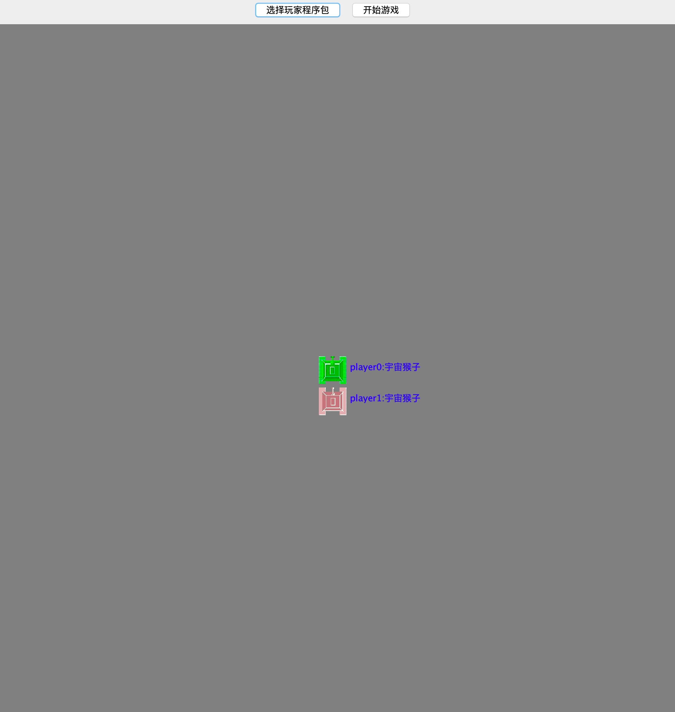
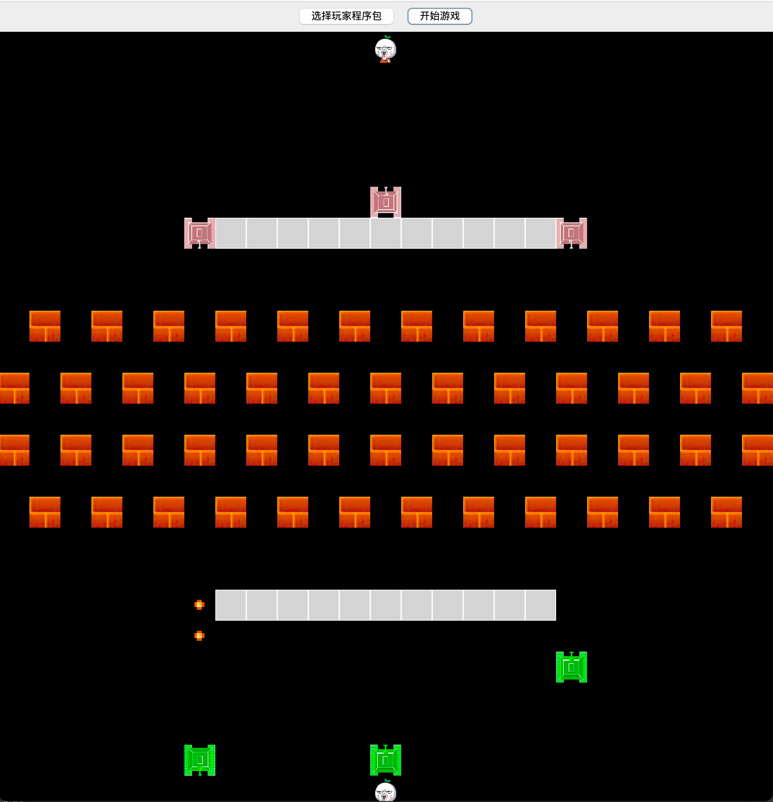
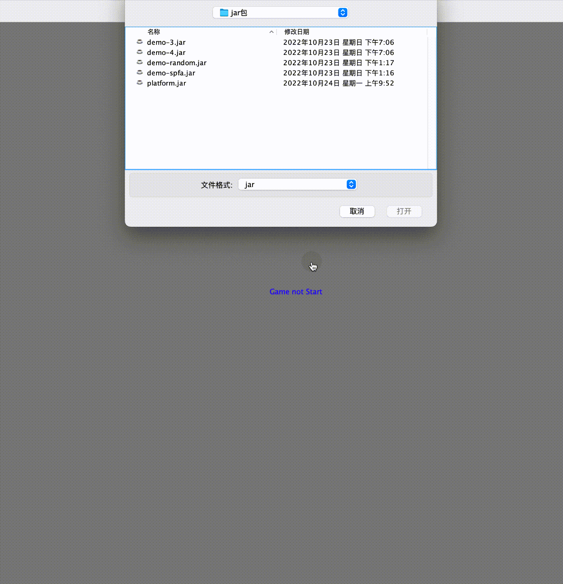
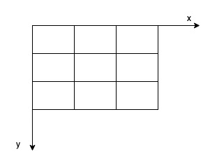

项目介绍
- 项目名称
    - 趣味代码对战平台--坦克大战（TankWar）
- 项目简介
    - 这个一个比赛双方提交编译过后 的代码 ，能够实时进行算法对抗的平台。可以写出自动化的策略，选手可参考的算法范围有《图论》、《搜索》、《博弈论》等算法支持，来决定当前坦克是前进、转向、开炮、还是停留在原地。只要能打掉对方所有坦克便算赢了。
    - 玩法规则：
        - 地图上分为敌我坦克，每方初始均存在3个坦克，以及一个老巢
        - 哪一方率先打掉对方的老巢，哪一方便率先获胜
        - 比赛 双方 可通过内置API获取当前游戏数据来支撑 AI算法
        - 每控制 一个坦克每一回合都可以下达 转向、开炮、前进等指令
- 项目配图
    - 加载玩家代码包
      
    - 对战截图
      
    

- 项目说明
    - 技术挑战：
        - 需要实现通过加载动态库的方式，实时计算出相应的策略，涉及AI算法、图论及搜索算法，通过算法智能控制坦克是一个非常大的挑战。本身在游戏框架实现也要考虑规则判定、边界case，碰撞检测，游戏数据刷新等诸多问题。
    - 应用场景：
        - 主要应用于构建趣味编程比赛 ，让写代码更有趣，使所有字节的研发同学都有一个 coding 同台竞技的平台，让身怀绝技的同学能释放一下能量。
    - 创新性：
        - 打破传统的做题目竞赛方式 ，增加比赛的可玩性。
    
- 演示视频
    


- 代码说明 
    - 玩家接口定义
        ```java
        public interface Player {

            /**
            *
            * @param map 当前地图, 0 代表空地，1代表坦克，2代表砖块，3，代表子弹，3，代表正在爆炸，5代表铁墙，6 代表老家
            * @param my 我方阵营信息
            * @param enemies 敌方阵营信息
            * @return 返回对我方的每个坦克的指令控制
            */
            List<Command> getAction(int[][] map, Camp my,List<Camp> enemies);


            /**
            *
            * @return  比赛团队名称 ，给你的团队起个名字吧
            */
            String getName();
        }
    - 控制坦克指令对象
        ```java
            public enum Action {

            Move(0), //向当前方向移动一个单位
            Turn(1),  //调转一个方向
            Fire(2),  //向前方开火
            DoNothing(3);  //停留在原地，什么也不做

            int action;

            Action(int action){
            this.action = action;
        }
    - 坐标系构建:
        框架中利用二维数组来构建了一个二维笛卡尔坐标系，纵轴为y 轴，横轴为x轴，
        坐标(x,y)转换 数组上的点就表示为 map[y][x];
        
        


    